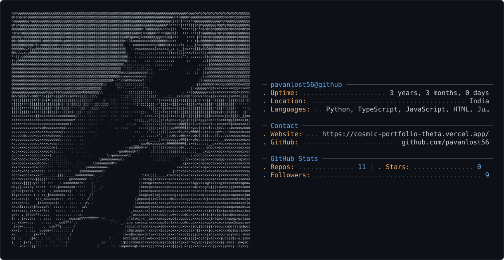

<picture>
  <source media="(prefers-color-scheme: dark)" srcset="dark_mode.svg" />
  <source media="(prefers-color-scheme: light)" srcset="light_mode.svg" />
  
</picture>

# Ajmeera Pavan Kumar  
**AI/ML Student · Creative Coder · Curious Builder**

---

## 🎯 About Me  
> *“I don’t just code, I craft solutions.”*  

Passionate about building **AI models, backend systems, and automation tools** that solve real problems.  
I enjoy blending creativity with logic to turn ideas into impactful projects.

---

## 🔧 Skills  
**Languages**: Python, Go, JavaScript, Java, SQL  
**AI/ML**: TensorFlow, PyTorch, Jupyter, Pandas, NumPy  
**Backend/DevOps**: Docker, AWS, Git, Linux, REST API  

---

## 📌 Featured Projects  
- [ML-Projects](https://github.com/pavanlost56/ML-Projects) – Modular ML work: Credit scoring, handwriting recognition, disease models  
- [AI-Prompt-Generator](https://github.com/pavanlost56/AI-PROMPT-GENERATOR) – Python + CustomTkinter GUI for creative AI prompts  
- [Swecha-Project](https://github.com/pavanlost56/swecha-project) – Collaborative project exploring tech for social impact  
- [Tron_CLI](https://github.com/pavanlost56/Tron_CLI) – Minimal CLI tool written in Go  

---

## 📊 GitHub Stats  

  
    
    

  

---

## 📮 Connect  
[GitHub](https://github.com/pavanlost56) | [LinkedIn](https://www.linkedin.com/in/pavan-kumar-ajmeera-8b3ba3318/) | [Portfolio](https://cosmic-portfolio-theta.vercel.app/)  

---

*“Keep your code simple, but your imagination limitless.”*  
